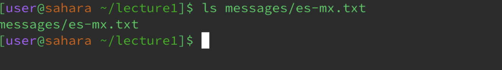
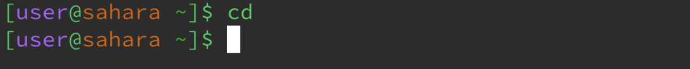
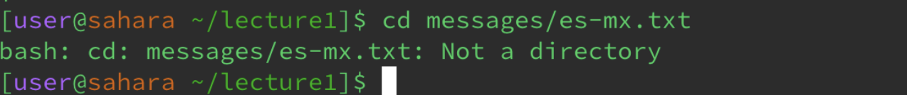

# Lab 1 Report 
## Misha Tavera
---
**'ls' Command**

The working directory that I began with in this was the home directory. 

From the home directory I input the 'ls' command followed by a path to directory 'lecture1'

**'cd' command**

For this command I was working in the home directory. 

Starting in the home directory I used a path to directory 'lecture1' as the argument following the 'cd' command.

** 'cat' Command**

Once again to execute this command with no arguments I began from the home directory.

I input the command cat followed by the path to directory 'lecture1'. 

