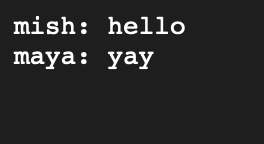
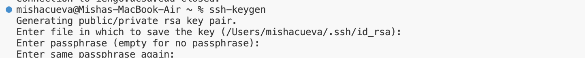
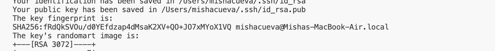
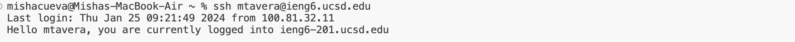

# Lab Report 2 
## Misha Tavera
---
Below is the code for the web server 'ChatServer' that supports the appropriate paths and behaviors for Lab 2. 
## Part 1

    import java.io.IOException;
    import java.net.URI;

    class Handler implements URLHandler {
        String messageString="";

    public String handleRequest(URI url) {
        if (url.getPath().equals("/")) {
            return String.format("enter message: %s", messageString);
        } else if (url.getPath().contains("/add-message")) {
            String[] parameters = url.getQuery().split("&");

            String user = "";
            String message = "";

            for (String param : parameters) {
                String[] keyValue = param.split("=");
                if (keyValue.length == 2) {
                    String key = keyValue[0];
                    String value = keyValue[1];

                    if ("user".equals(key)) {
                        user = value;
                    } else if ("s".equals(key)) {
                        message = value;
                    }
                }
            }

           if (user != null && message != null) {
                messageString += user + ": " + message + "\n";
                return messageString;
            }
        }

        return "404 Not Found!";
    }
    }

    class ChatServer {
    public static void main(String[] args) throws IOException {
        if (args.length == 0) {
            System.out.println("Missing port number! Try any number between 1024 to 49151");
            return;
        }

        int port = Integer.parseInt(args[0]);
        Server.start(port, new Handler());
    }
    }

Upon creating a server the image above is what appears prompting us to enter a message. 
"https://0-0-0-0-1551-7ospflere607e0lv1591qpk9ok.us.edusercontent.com"

I add the message "hello" from myself as the user with the request '/add-message?s=hello&user=mish'. The complete link is located just below. 

"https://0-0-0-0-1551-7ospflere607e0lv1591qpk9ok.us.edusercontent.com/add-message?s=hello&user=mish"

"https://0-0-0-0-1551-7ospflere607e0lv1591qpk9ok.us.edusercontent.com/add-message?s=yay&user=maya"

"https://0-0-0-0-1551-7ospflere607e0lv1591qpk9ok.us.edusercontent.com/add-message?s=finally&user=mish"

## Part 2

Absolute Path To The Private Key:

Absoulte Path To The Public Key:

Password No Longer Required:

## Part 3 

In week 2 and 3 I learned and practiced how to build and run a server. This is all very new to me so I did not know the process of any of it. I learned how to run the serve in my EdStem workspace `javac`,`java` commands, and a port number. I did not know what this was either, but now to my understanding it identifies the port number that the server runs on which is apart of a URL. Along with this I also learned how to use paths/queries in URL's which made changes depending on the code!
