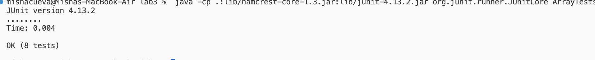
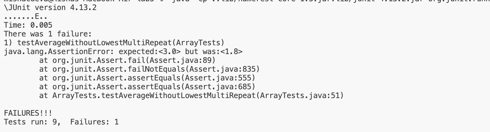
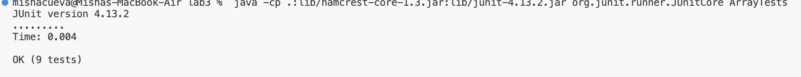

# LabReport 3
## Misha Tavera

--- 
## Part 1: Bugs

The focus of this lab (week 4) was practicing writing test cases leading to the discovery of bugs in the program through catching symptoms in the test cases. I will walk through this process using the method `averageWithoutLowest` from the program. The original piece of code for this method was as follows: 

#### Before Code: 
```
   // Averages the numbers in the array (takes the mean), but leaves out the
  // lowest number when calculating. Returns 0 if there are no elements or just
  // 1 element in the array
  static double averageWithoutLowest(double[] arr) {
    if(arr.length < 2) { return 0.0; }
    double lowest = arr[0];
    for(double num: arr) {
      if(num < lowest) { lowest = num; }
    }
    double sum = 0;
    for(double num: arr) {
      if(num != lowest) { sum += num; }
    }
    return sum / (arr.length - 1);
  }
````

In the original code block there is a brief description of what the method should do, which is to average numbers in an array leaving out the lowest number. I started by running several tests such as the ones below: 

#### Passing Tests:
```
   @Test
  public void testAverageWithoutLowest3(){
    double [] input1= {1};
    assertEquals(0,ArrayExamples.averageWithoutLowest(input1),0.0001);
  }
   @Test
  public void testAverageWithoutLowest4(){
    double [] input1= {1,2};
    assertEquals(2,ArrayExamples.averageWithoutLowest(input1),0.0001);
  }
     @Test
  public void testAverageWithoutLowest5(){
    double [] input1= {1.0,2.0,3.0};
    assertEquals(2.5,ArrayExamples.averageWithoutLowest(input1),0.0001);
  }
```


As we can see all of these tests passed. It took me a little while to identify the bug in this program as it had passed several tests. I eventually realized I had not considered the possibility of multiple instances of the lowest value to appear in the array. So, I wrote the test case: 

#### Failure-Inducing Input:

``` 
   @Test
    public void testAverageWithoutLowestMultiRepeat(){
    double [] input1= {1,1,1,2,3,4};
    assertEquals(3.0,ArrayExamples.averageWithoutLowest(input1),0.0001);
 }
```




With this test I found that the program did not produce the correct output for calculating the average. The symptom/output of the failed test case gave me an idea of a potential flaw in the method. Comparing my expected output to the actual output helped me to confirm the bug in the method was indeed because the method is written to return `sum /(arr.length - 1)`, meaning in calculating the average it only returns the length of the array minus 1. But in the case that there are multiple instances of the lowest value in the array the method should be able to exlude all instances from being in the calculation. I was able to confirm this because with the relatively simple numbers I decided to calculate the average of this array `{1,1,1,2,3,4}`,following the original code I got the the calculation for average was the sum of the non lowest values (2+3+4=9) over the length of the array minus 1 (5). So it returned `9/5` giving us the output `1.8`, the same output of the method we got running our failed Junit test. Taking this information I had identified the error in the method `averageWithoutLowest`, which as mentioned before was that it did not handle the case of multiple instances of the lowest value in the array and was incapable of caluclating our expected average for failure to consider that more than one instance in the array would need to be excluded for the calculation in cases like these. To change the code to handle these cases I modified the code:

#### Once again the original code with bug:                          
```
   // Averages the numbers in the array (takes the mean), but leaves out the
  // lowest number when calculating. Returns 0 if there are no elements or just
  // 1 element in the array
  static double averageWithoutLowest(double[] arr) {
    if(arr.length < 2) { return 0.0; }
    double lowest = arr[0];
    for(double num: arr) {
      if(num < lowest) { lowest = num; }
    }
    double sum = 0;
    for(double num: arr) {
      if(num != lowest) { sum += num; }
    }
    return sum / (arr.length - 1);
  }
````
#### The code after my modifications to address the bug: 
```
  static double averageWithoutLowest(double[] arr) {
    if(arr.length < 2) { return 0.0; }
    double lowest = arr[0];
    for(double num: arr) {
      if(num < lowest) { lowest = num; }
    }
    double lowcount = 0;
    double sum = 0;
    for(double num: arr) {
      if(num != lowest)
         { sum += num; }
      else if (num == lowest){   
        lowcount +=1;
    }
  }
    return sum / (arr.length - lowcount);
  }
```
I modified the code subtract all instances of the lowest number to the overall value, that is, dividing sum in our return by the correct formula for excluding the `lowest` values from any of the calculation. Much of the code remains similar to the original, only now if the `num` in the array is equal to the value of `lowest` then the new variable `lowcount` is incremented accordingly. Then to the return statement rather than simly subtracting `-1` from the aray length to accomodate all test cases it now instead subtracts the number of times the `lowest` value appears in the array (`lowcount`).  After doing so, I re-ran the test case again and recieved the following: 



As we can see from the image above the final test passed meaning a successful fix of the bug. To be thourough I tested with several more examples of these cases and can confirm those passed as well. 


## Part 2: Researching Commands

In week 5 lab we focused on a few commands, specifically `less` , `find`, and `grep`. We practiced using these commands to to do a variety of things relating to our directiories and files from `./technical`, such as counting the number of words of a file, the number of characters, looking for specific strings, etc. We utilized a few of the many command-line options of these commands and I continued to explore some more. I have focused on the `find` command and here are some interesting/usful command-line options I found: 


#### Command-Line Option: `-type`

When using the `find` command the `-type` command-line option can be very useful in specifying the type of files that you intend to look for. It can help specify your search to files or directories. I demonstrate below how to use these commands in examples from `./technical` which we used in week 5 lab.

##### Directory Use:

`-type d`

This specific command-line option will find directories hence the `-d`. In the example below the whole command I used is `find ./technical -type d`. The output of this command, also shown below, is the list of directory paths in the within the directory `./technical`. 
```
Mishas-MacBook-Air:docsearch mishacueva$ find ./technical -type d
./technical
./technical/government
./technical/government/About_LSC
./technical/government/Env_Prot_Agen
./technical/government/Alcohol_Problems
./technical/government/Gen_Account_Office
./technical/government/Post_Rate_Comm
./technical/government/Media
./technical/plos
./technical/biomed
./technical/911report
```
##### File Use:

`-type f` 

With similar logic as the `-type d` example we have seen just above the `-type f` command is essentially the same only `f` will find files. In the example below the command I use is `find ./technical -type f | head -n 5`. The output of this command is the list of file paths in the current directory. Note `|head -n 5` is used to shorten the extensive list of paths to files in `./technical`. We have examples of this before in lectures/lab but to briefly summarize, this command option for `find` only prints the first number of files that you specify. In this case we have the `5`, so it is printing only the first 5 paths to files in `.technical`. 

```
Mishas-MacBook-Air:docsearch mishacueva$ find ./technical -type f | head -n 5
./technical/government/About_LSC/LegalServCorp_v_VelazquezSyllabus.txt
./technical/government/About_LSC/Progress_report.txt
./technical/government/About_LSC/Strategic_report.txt
./technical/government/About_LSC/Comments_on_semiannual.txt
./technical/government/About_LSC/Special_report_to_congress.txt

```


#### Command-Line Option: `-user`

This options `-user` followed by the name of a specified user searches for files/directories owned by the user specified. This can be useful perhaps on shared projects to find your own or another persons files/directories. To show how to use this option of `find` I once again use `./technical` from week 5. 

##### Directory Use: 

Below I use the command line `find ./technical -type d -user mishacueva |head -n 5`. I use the command that we just seen `-type d` to find only directories owned my specific user `mishacueva`. The output here is the paths to only directories in `./technical` that are owed by myself. 

```
Mishas-MacBook-Air:docsearch mishacueva$ find ./technical -type d -user mishacueva |h
ead -n 5
./technical
./technical/government
./technical/government/About_LSC
./technical/government/Env_Prot_Agen
./technical/government/Alcohol_Problems
```
##### File Use: 

Similarly here, I use the same command line only this type searching for `-type f` paths in `./technical` owned my `mishacueva`.

```
Mishas-MacBook-Air:docsearch mishacueva$ find ./technical -type f -user mishacueva | head -n 5
./technical/government/About_LSC/LegalServCorp_v_VelazquezSyllabus.txt
./technical/government/About_LSC/Progress_report.txt
./technical/government/About_LSC/Strategic_report.txt
./technical/government/About_LSC/Comments_on_semiannual.txt
./technical/government/About_LSC/Special_report_to_congress.txt
```
The combination of these three options, `-type` , `-user`, and `-n`,  for `find` command are very useful together here as it shortens the length of the output significantly. The `-user` option would work on its own however, I use this combination to demonstrate its abilities for files/directories and to have a manageable output for the purpose of the example. 

#### Command-Line Option: `-maxdepth`/`-mindepth`

The two options for `find`,   `-maxdepth` and `-mindepth`, are useful in that they limit the depth at which the search explores, specifically the depth of directories. I feel that this would help for particularly large projects when directory depth can get to be large as it specifies to up to what point (or to what minimum) that you want your search to cover. I have included both options here because I feel that they are rather similar in purpose. As the name of the options indicate `-maxdepth` followed by a specific number specifies the maximum limit the depth of command `find`. On the other hand, `-mindepth` followed by a number sets the minimum depth at which the `find` command must meet. Below I give an example of the `-maxdepth` option. 

##### Directory Use: 

Here, I use the `find` command along with option `-maxdepth 1` to indicate that I want my search to limit the depth of directory search to only `1`. Paired with the `-type d` option, in this command I am only searching for the directory types to the limit of one directory in `./technical` ( I also use `|head -n 5` to limit the output to only the first 5 lines).

```
Mishas-MacBook-Air:docsearch mishacueva$ find ./technical -type d -maxdepth 1 |head -n 5
./technical
./technical/government
./technical/plos
./technical/biomed
./technical/911report
```

##### File Use:

Here, I once again use `-maxdepth` to limit my search only this time I incate a limit of directory depth `3`. In this example I also use the `-type f` command to demonstrate its use for file searching. Below file types are searched for at a limit of directory depth `3`, so this command also works for file searching. I have also limited the output once again to only `5` lines as seen in the command line and in the output. 

```
Mishas-MacBook-Air:docsearch mishacueva$ find ./technical -type f -maxdepth 3 |head -
n 5
./technical/government/About_LSC/LegalServCorp_v_VelazquezSyllabus.txt
./technical/government/About_LSC/Progress_report.txt
./technical/government/About_LSC/Strategic_report.txt
./technical/government/About_LSC/Comments_on_semiannual.txt
./technical/government/About_LSC/Special_report_to_congress.txt
```

#### Command-Line Option: `-size`

The `find` command option `-size` followed by a specific size will perform a search based on the size inciated in the command line and it is useful for just that reason. Having a size included in your search can more specifically narrow your search and can catch perhaps specific files your are looking for that are particularly large or small, whatever the size is that you are searching for. There are various suffixs for searching for a specific size such as `k` for kilobytes , `M` for megabytes, and so on (a more detailed list of these can be found in the link of sources at the end). In the examples below I use the `k` suffix, which looks like:

##### Directory Use: 

I use the specific `-size` search of `-100k`, breaking this down the `-` eseentially means less than and the `100k` is referencing the size 100 kilobytes. In short, the command is searching for the size of directories in `./technical` , which is specifice below with `-type d`, that are less than `100` kilobytes. The output is the directories that meet such search criteria. 
```
Mishas-MacBook-Air:docsearch mishacueva$ find ./technical -type d -size -100k
./technical
./technical/government
./technical/government/About_LSC
./technical/government/Env_Prot_Agen
./technical/government/Alcohol_Problems
./technical/government/Gen_Account_Office
./technical/government/Post_Rate_Comm
./technical/government/Media
./technical/plos
./technical/biomed
./technical/911report
```
##### File Use: 

Below I use the `find` command option `-size` once again to search narrow my search down, this time I use `-size +150k` which in other words is searching for what exeeds the size of `150` kilobytes (the `+` representing the sizes greater than `150k`). This time I also specify my search to `-type f` to search for files that meet this size specification. Correspondinly the output is paths to files that meet this criteria. 

```
Mishas-MacBook-Air:docsearch mishacueva$ find ./technical -type f -size +150k
./technical/government/About_LSC/commission_report.txt
./technical/government/Env_Prot_Agen/multi102902.txt
./technical/government/Env_Prot_Agen/bill.txt
./technical/government/Env_Prot_Agen/tech_adden.txt
./technical/government/Gen_Account_Office/GovernmentAuditingStandards_yb2002ed.txt
./technical/government/Gen_Account_Office/Statements_Feb28-1997_volume.txt
./technical/government/Gen_Account_Office/pe1019.txt
./technical/government/Gen_Account_Office/d01591sp.txt
./technical/911report/chapter-13.4.txt
./technical/911report/chapter-13.5.txt
./technical/911report/chapter-3.txt

```

#### Takeaway: 

This various command-line options for the `find` command are VERY useful to navigate through directories and files especially of large work spaces. There are also many more options for the `find` command than those that I have used in this report that would also be useful and worth looking over. With that said, something to take away is that the combination of these various options will aid in even more specific results. We have combined a few already in the above examples but to further emphasize the level of use of these options I provide another example below: 

##### Combination of `-type`, `-user`, `-maxdepth`, `-size`: 

```
Mishas-MacBook-Air:docsearch mishacueva$ find ./technical -type f -user mishacueva -maxdepth 2 -size +100k
./technical/biomed/1471-2105-3-2.txt
./technical/911report/chapter-13.4.txt
./technical/911report/chapter-13.5.txt
./technical/911report/chapter-13.2.txt
./technical/911report/chapter-13.3.txt
./technical/911report/chapter-3.txt
./technical/911report/chapter-1.txt
./technical/911report/chapter-6.txt
./technical/911report/chapter-7.txt
./technical/911report/chapter-9.txt
./technical/911report/chapter-12.txt

```
Here I combine all the options we just learned. I end up with a `find` command that searches `./technical` for file types owned by user `mishacueva` at a directory depth of 2 that exceed the size of `100` kilobytes. The files that meet this search are shown in the output after running the command. All of these can be used in a various combination of ways specific to what you are looking for!

#### Sources:

https://ss64.com/bash/find.html

https://tecadmin.net/linux-find-command-with-examples/


