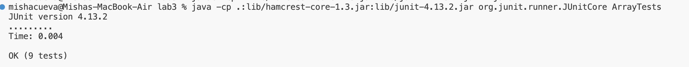
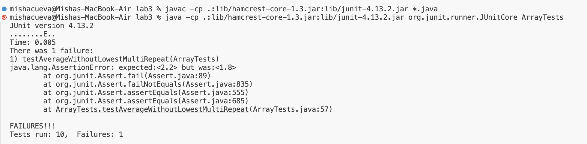
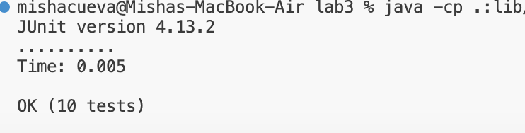

# LabReport 3
## Misha Tavera

--- 
## Part 1: Bugs

#### Failure-Inducing Input:

``` 
   @Test
    public void testAverageWithoutLowestMultiRepeat(){
    double [] input1= {1,1,1,2,3,4};
    assertEquals(2.2,ArrayExamples.averageWithoutLowest(input1),0.0001);
 }
```

#### Passing Tests:
```
   @Test
  public void testAverageWithoutLowest3(){
    double [] input1= {1};
    assertEquals(0,ArrayExamples.averageWithoutLowest(input1),0.0001);
  }
   @Test
  public void testAverageWithoutLowest4(){
    double [] input1= {1,2};
    assertEquals(2,ArrayExamples.averageWithoutLowest(input1),0.0001);
  }
     @Test
  public void testAverageWithoutLowest5(){
    double [] input1= {1.0,2.0,3.0};
    assertEquals(2.5,ArrayExamples.averageWithoutLowest(input1),0.0001);
  }
```


#### After Code: 

The focus of this lab (week 4) was practicing writing test cases leading to the discovery of bugs in the program through catching symptoms in the test cases. I will walk through this process using the method `averageWithoutLowest` from the program. The original piece of code for this method was as follows: 

#### Before Code: 
```
   // Averages the numbers in the array (takes the mean), but leaves out the
  // lowest number when calculating. Returns 0 if there are no elements or just
  // 1 element in the array
  static double averageWithoutLowest(double[] arr) {
    if(arr.length < 2) { return 0.0; }
    double lowest = arr[0];
    for(double num: arr) {
      if(num < lowest) { lowest = num; }
    }
    double sum = 0;
    for(double num: arr) {
      if(num != lowest) { sum += num; }
    }
    return sum / (arr.length - 1);
  }
````

In the original code block there is a brief description of what the method should do, which is to average numbers in an array leaving out the lowest number. I started by running several tests such as the ones below: 


#### Passing Tests:
```
   @Test
  public void testAverageWithoutLowest3(){
    double [] input1= {1};
    assertEquals(0,ArrayExamples.averageWithoutLowest(input1),0.0001);
  }
   @Test
  public void testAverageWithoutLowest4(){
    double [] input1= {1,2};
    assertEquals(2,ArrayExamples.averageWithoutLowest(input1),0.0001);
  }
     @Test
  public void testAverageWithoutLowest5(){
    double [] input1= {1.0,2.0,3.0};
    assertEquals(2.5,ArrayExamples.averageWithoutLowest(input1),0.0001);
  }
```


As we can see all of these tests passed. It took me a little while to identify the bug in this program as it had passed several tests. I eventually realized I had not considered the possibility of multiple instances of the lowest value to appear in the array. So, I wrote the test case: 

#### Failure-Inducing Input:

``` 
   @Test
    public void testAverageWithoutLowestMultiRepeat(){
    double [] input1= {1,1,1,2,3,4};
    assertEquals(2.2,ArrayExamples.averageWithoutLowest(input1),0.0001);
 }
```




With this test I found that the program did not produce the correct output for calculating the average. The symptom/output of the failed test case gave me an idea of a potential flaw in the method. Comparing my expected output to the actual output helped me to confirm the bug in the method was indeed because the method excluded all instances of the lowest number in the calculation for the average of the array. I was able to confirm this because with the relatively simple numbers I decided to calculate the average of this array `{1,1,1,2,3,4}` excluding all of the lowest values `1` and I calculated `1.8`, the same output of the method. Taking this information I had identified the error in the method `averageWithoutLowest`, which as mentioned before was that it did not handle the case of multiple instances of the lowest value in the array and instead excluded all instances of them. To change the code to handle these cases I modified the code:

Once again the original code with bug:                          
```
   // Averages the numbers in the array (takes the mean), but leaves out the
  // lowest number when calculating. Returns 0 if there are no elements or just
  // 1 element in the array
  static double averageWithoutLowest(double[] arr) {
    if(arr.length < 2) { return 0.0; }
    double lowest = arr[0];
    for(double num: arr) {
      if(num < lowest) { lowest = num; }
    }
    double sum = 0;
    for(double num: arr) {
      if(num != lowest) { sum += num; }
    }
    return sum / (arr.length - 1);
  }
````
The code after my modifications to address the bug: 
 ```
  static double averageWithoutLowest(double[] arr) {
    if(arr.length < 2) { return 0.0; }
    double lowest = arr[0];
  
    for(double num: arr) {
      if(num < lowest) { lowest = num; }
    }
    double sum = 0;
    for(double num: arr) {
      if(num >= lowest) 
      { sum += num;}
    }
    return (sum-lowest) / (arr.length - 1);
  }
```
I modified the code to add all instances of the lowest number to the overall value `sum` and returned the sum minus one instance of `lowest` over the number of values in the string, excluding one instance of the `lowest`, to achieve the inteded average of the array. After doing so, I re-ran the test case again and recieved the following: 



As we can see from the image above the final test passed meaning a successful fix of the bug. To be thourough I tested with several more examples of these cases and can confirm those passed as well. 


## Part 2: Researching Commands

