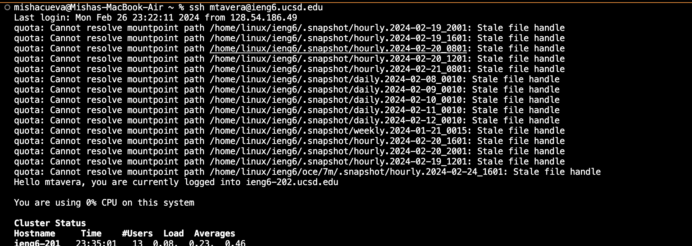
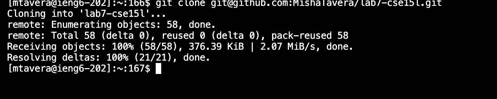
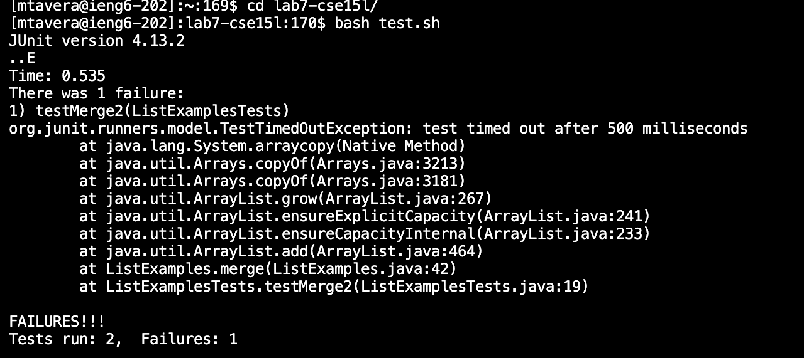
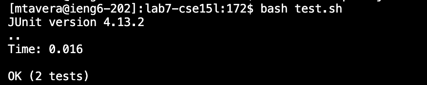
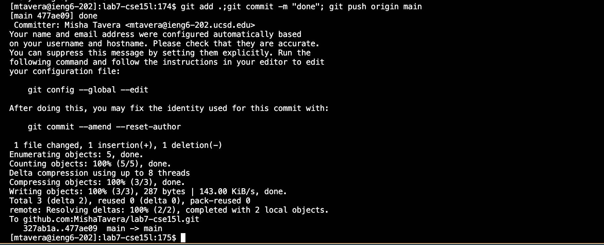

# Lab Report 4
## Misha Tavera
----- 
  In this weeks lab we focused on using `vim` to develop our skills and eficiency in editing any program. We essentially doing this by using `vim` and it's command-line function of diirectly making edits to a piece of code from the command line. To summarize, `vim` has two modes, normal mode and insert mode. The insert mode essentially allows you to make the edit to the code by typing in any changes, while in the normal mode all keys have some kind of function that help you navigate through any text of code effciently. In this normal mode, there is a long list of what each key can do but for this lab we only used some of the many which I explain below. 

### Our Task

We are given these steps to complete:
  - Log into ieng6
  - Clone your fork of the repository from your Github account (using the SSH URL)
  - Run the tests, demonstrating that they fail
  - Edit the code file to fix the failing test
  - Run the tests, demonstrating that they now succeed
  - Commit and push the resulting change to your Github account (you can pick any commit message!)

  In the lab we had a code file that contained an error, our task was to edit the code using `vim`. It was only a small error but the focus here was to practice and get familiar with some elements of `vim` and how it can make editing a code file quite simple and fast all from the command line. We were encouraged to go first with our immediate guess to approach the edit based on some basic information we had from lectures/lab. Then, using some provided tips and resources we retry to make the edit with the intention of fewer keystrokes or in a faster manner. 

----
#### First-Try:

Going into it my first initial way of going about it was to use `vim` to pull up the code file with the error and (in normal mode) use the 'j' key repeatedly to find the line I was looking for. Then I used the `l` to move my cursor to the right character by character. Using the `i` key to change to insert mode I used `<backspace>` and then typed the my intended change accordingly. What that looked like exactly in keystrokes is: 

`m,t,a,v,e,r,a,@,i,e,n,g,6,.,u,c,s,d,.,e,d,u,<enter>,`(log into ieng6),`g,i,t, c,l,o,n,e, <command> v,<enter>` (clone fork of repository ussing SSH URL, which I already had copied to clipboard),  `c,d,<space>,c,s,e,1,5,l, -,l, a,b,7,<enter>`(to enter the correct directory)  `b,a,s,h, <space>, t,e,s,t,.,s,h,<enter>`(running the tests to find failures) `v,i,m, L,i,s,t,E,x,a,m,p,l,e,s,.,j,a,v,a,<enter>` (opening the code file using vim) `j, j, j, j, j, j, j, j, j, j, j, j, j, j, j, j, j, j, j, j, j, j, j, j, j, j, j, j, j, j, j, j, j, j, j, j, j, j, j, j, j, j, j, l, l, l, l, l, l, l, l, l, l, l, l, i,<backspace>,2 `(to make the change ``1`` to ``2`` after `index`)`, <esc>, :,w,q, <enter>` (editing the code file to fix the failing test), `b,a,s,h, <space>, t,e,s,t,.,s,h,<enter>` (to check all tests now pass) and finally` g,i,t, <space>, a,d,d,<space>, .,<enter>, g,i,t, <space> , c,o,m,m,i,t, <space> , -, m, <space> , MESSAGE,<enter>, g,i,t , <space> ,o,r,i,g,i,n, <space> ,m,a,i,n, <enter>` to commit and push all changes to the repository. 

----

All in all it was quite a lengthy way of going about it, taking me a time of 2:49 to go about it. After some research into different ways to help speed the process I succeeded in a more efficient solution to completing this task. Resetting and starting fresh I took a new route and this time I was able to complete the task in 2:06. The images below show just each step that I went through. 

#### Final Solution:

1. Logging into ieng6:

]

`m,t,a,v,e,r,a,@,i,e,n,g,6,.,u,c,s,d,.,e,d,u,<enter>,`(log into ieng6).

2. Cloning fork from Repository:

]

`g,i,t, c,l,o,n,e, <command> v,<enter>` (clone fork of repository ussing SSH URL, which I already had copied to clipboard),

3. Running the tests:

]

`c,d,<space> l,<tab>, -, c,<tab>, <enter>`(to enter the correct directory)   `b,a,s,h, <space>, t, <tab>, <enter>` (to run the tests, 
checking for bugs)

4. Editing code:

]
]

`v,i,m, <space>, L, <tab>, ., j,a,v,a,<enter>`(to open the code file to start making an edit to the error)Using my keypad I scrolled down to near line 44 then used `j,j` ,to land on 44 which had the error.`e` (to jump to  the end of the first word) ,`r` (to replace a single character), `2` (the necessary edit), `<esc> `, `:,w,q, <enter> ` to save and quit.

5. Rerun Tests

]

`b,a,s,h, <space>, t, <tab>, <enter>`(to check that the tests now run properly).

6. Commit and Push Changes:

]

Now that the code is fixed I commit and push my changes to the repository with `g,i,t,<space>,a,d,d,<space>,.,;,g,i,t,<space>,c,o,m,m,i,t,<space>,-,m,<space>,",m,e,s,s,a,g,e,",;,g,i,t,<space>,p,u,s,h,<space>,o,r,i,g,i,n, <space>,m,a,i,n,<enter> `(all in one command line). 

As we can see from the time an the keystrokes it was a more efficient way of making this edit to the text code. In this case, it was on a very small scale edit so perhaps there is not much of a significant change. However, utilizing these functions of `vim`, and other keyboard shortcuts in general, on a larger project would lead to many instances of faster editing overall increasing efficiency and simplicity of making edits and all from the command line.
