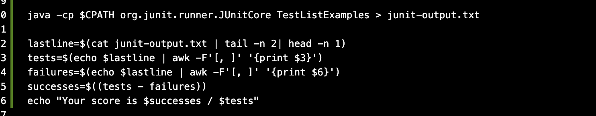
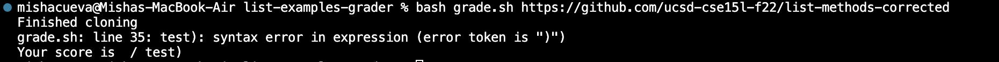
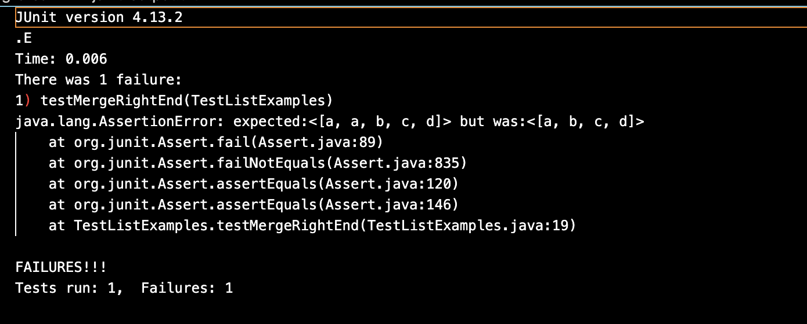
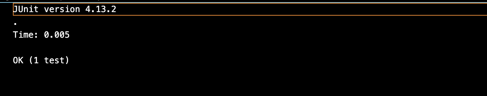
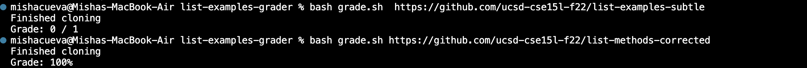

# Lab Report 5
## Misha Tavera
----- 
## Part 1: Debugging Scenario 

In lab we were trying to work on writing our grading script for `ListExamplesGrader.java`. For the grading script I have written it to first make sure the repository has the necessary files and that it will compile. The last component to my grading script ,`grade.sh `, I have written what is intended to return a score based on the results of out Junit tests in `TestListExamples.java`. I have gotten it to work but I found something wrong with one output of my grading script when I run `bash grade.sh https://github.com/ucsd-cse15l-f22/list-methods-corrected`. I was working on this for a while but was not sure what I was doing wrong. 

---
**EsStemDiscussion**
> Misha: Hi, I am working on the autograding script from lab. I am having trouble getting it to work properly. I found there to be some kind of bug in my bash script but I can't seem to find it. The script works for most of the repositories we have to test our grader only it does not seem to work for the one that is supposed to be correct. From the output I believe it has something to do the last lines of my bash script where it calculates the student's score. I have tried changing the fields for `awk` but that doesn't seem to help, can anyone please help?
>
>  My grading script: 
>
> My command and it's buggy output: 
>
>
> > TA: Looking at your output what is being printed that shouldn't be and where is this coming from? Hint look at the actual output in the `grading area`. How is the output different from other repositories that do pass? And how should this be reflected in your bash grading script?
> >
> > >Misha: Thank you this was very helpful I see where I went wrong. My bug is in that my `grade.sh` the lines to print out a score are hard coded. By looking in `junit-output.txt`, which is where the jUnit output of my `TestListExamples.java` is redirected, I see that the bash scrip is only set up to successfully print and score the repositories that had some kind of error in them. To correct this I will add to my bash script to account for not only the repositories with errors but the ones that pass and print a different output in `junit-output.txt`.
> > >
> > >My `junit-output.txt` of a repository with errors: 
> > >My `junit-output.txt` of the passing repository: 

---

With the help of a TA I now see what may be my issue. Below I will include a run down of my set up and how I will fix my bug. 

* The file & directory structure needed:
  - grading-area
      - lib
          - hamcrest-core-1.3.jar
          - junit-4.13.2.jar
      - junit-output.txt
      - ListExamples.java
      - TestListExamples.java
  - lib
      - hamcrest-core-1.3.jar
      - junit-4.13.2.jar
  - student-submission
      - ListExamples.java
  - grade.sh
  - GradeServer.java
  - Server.java
  - ta-output.txt
       - TestListExamples.java
 
* The contents of files before fixing the bug:
  For reference here is my complete bash script `grade.sh`:

```
CPATH='.:../lib/hamcrest-core-1.3.jar:../lib/junit-4.13.2.jar'

rm -rf student-submission
rm -rf grading-area

mkdir grading-area

git clone $1 student-submission 2> ta-output.txt
echo 'Finished cloning'

if [[ -f "./student-submission/ListExamples.java" ]]
then 
cp student-submission/ListExamples.java grading-area/
cp TestListExamples.java grading-area/
cp -r lib grading-area
else 
    echo "Missing necessary files"
    exit 1
fi 

cd grading-area 
javac -cp $CPATH *.java

if [[ $? -ne 0 ]]
then 
    echo "The program failed to compile"
    exit 1
  fi
```
The `junit-output.txt` file 

```
JUnit version 4.13.2
.
Time: 0.004

OK (1 test)

```

* The full command line (or lines) you ran to trigger the bug:

```
`bash grade.sh https://github.com/ucsd-cse15l-f22/list-methods-corrected`
```
* A description of what to edit to fix the bug:

I am going to change the last few lines of my `grade.sh` script to better adhere to the differences in the `junit-output.txt` between what the output looks like with a flawed repository compared to a passing one. I am doing this because I realize, with the help of a TA, that what I have currently is only successful in the cases that have errors becuse my bash script is written as so. Currently, it only prints out the score by going to the lastline and printing out the number of failures and tests. For example when I run the command `bash grade.sh  https://github.com/ucsd-cse15l-f22/list-examples-subtle`, the `junit-output.txt ` looks like this : 

and my output for score is: 

This is because my bash script is specifically coded with the intention of recieving this kind of output everytime. To fix this, I am going to account for the different `junit-output.txt` with a passing repository to correctly reflect a score. I have now changed by bash script by writing an `if` statement to consider the score of %100 and continued to keep some of my original scoring method since it worked well with the repositories with errors. This edit looks like: 

```
java -cp $CPATH org.junit.runner.JUnitCore TestListExamples > junit-output.txt
lastline=$(cat junit-output.txt | tail -n 2 | head -n 1)

if [[ $lastline = *OK* ]]
then
    echo "Grade: 100%"
else
    tests=$(echo $lastline | awk -F'[, ]' '{print $3}')
    failures=$(echo $lastline | awk -F'[, ]' '{print $6}')
    successes=$((tests - failures))
    echo "Grade: $successes / $tests"
fi
```
To ensure that this now works. I reran both a repository with erros and one passes all tests, to make sure I have fixed my bug but also to make sure I didn't unintentionally also effect the grading that worked on other repositories. This is what I found : 




From this I can see that I have succesfully fixed the bug in my `grade.sh` script. 


-----

## Part 2: Reflection

In general I enjoyed learning about all the topics we discussed but somethings that stood out to me is when we learned how to write a bash grading script. We did this in class and in lab in week 6 and I liked learning about it because I feel like it is something that definetly correlated to something in my life. Before I did not know or think about how any work was graded but now I do and even learned how to write one myself. I learned the actual specific like what goes into the actual grading bash script but in general I also just liked learning about kind of what goes on behind the scenes of something I hadn't thought of before. Especially because having taken other cse courses I have definetly interacted with grading scripts before being used on my own programming, so I thought it was cool to learn about how something like that works and is built. 
